# Messanger App

**From a Figma file to a running Mac app, built by a local AI agent.**

A proof of concept: one local model, two custom MCP servers, no cloud. The agent read the design in Figma, built the UI in Unreal Engine 5.8, and the result runs as a packaged Mac app. Every widget, animation and data asset in `Content/` was created by the agent.


<p align="center">
  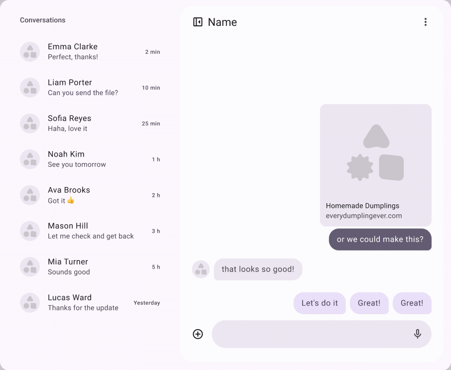
</p>

<p align="center">
  <a href="https://www.figma.com/community/file/1690047389706855415"><b>Figma file</b></a> ·
  <a href="https://github.com/MaxsBond/figma-bridge"><b>figma-bridge</b></a> ·
  <a href="#run-it"><b>Run it</b></a>
</p>

## Contents

- [The pipeline](#the-pipeline)
- [Architecture](#architecture)
- [Figma is the spec](#figma-is-the-spec)
- [Figma vs Unreal](#figma-vs-unreal)
- [Inside the Unreal project](#inside-the-unreal-project)
- [Engineering details](#engineering-details)
- [Hardware](#hardware)
- [Run it](#run-it)
- [Limitations](#limitations)

## The pipeline

| Step | Tool | Output |
|---|---|---|
| 1. Design | Figma, with build notes next to every frame | Components, 3 layout states, motion specs |
| 2. Read | [figma-bridge](https://github.com/MaxsBond/figma-bridge) (MCP) | Node trees, layout, colors, text, icons |
| 3. Build | unreal-bridge (custom MCP) | Widgets, layout, Blueprint logic, data assets, config |
| 4. Animate | unreal-bridge | UMG animations from the Figma motion specs |
| 5. Ship | Unreal packaging | Mac app (Apple Silicon) |

The agent ran on [Qwen3.8-27B](https://huggingface.co/Qwen/Qwen3.8-27B), locally, on the same Mac as Figma and the Unreal Editor.

## Architecture

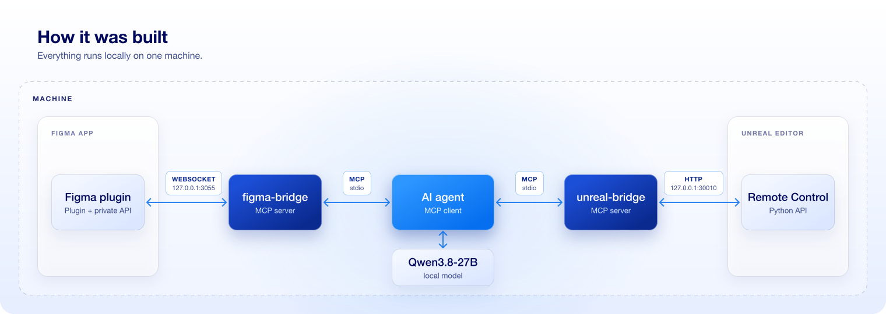

| Part | What it does | Talks over | Public |
|---|---|---|---|
| Agent | MCP client. Runs the local model and calls both bridges | MCP (stdio) | — |
| figma-bridge | MCP server + Figma dev plugin. Reads the open file through the Plugin API, including the private API. Works on a View seat, no rate limits | WebSocket `127.0.0.1:3055` | [Yes](https://github.com/MaxsBond/figma-bridge) |
| unreal-bridge | MCP server for the Unreal Editor, used instead of the official Unreal MCP. Runs editor Python: UMG widgets, animations, data assets, string tables, config | HTTP to Remote Control API `127.0.0.1:30010` | No |

**How the agent worked.** It did not click through the editor. It wrote throwaway Python scripts that described the UI and sent them to unreal-bridge: component widgets, the layout and its states, animations, chat logic, demo data. The scripts were deleted once the assets were done. The result lives in `Content/`.

## Figma is the spec

Every Figma page has notes next to the frames. The agent followed them when it built the Unreal side.

**Components.** Each Figma component maps 1:1 to a UMG User Widget with the same name. Text properties become exposed variables, variants become a state enum or a WidgetSwitcher, auto layout becomes Horizontal/Vertical Box.

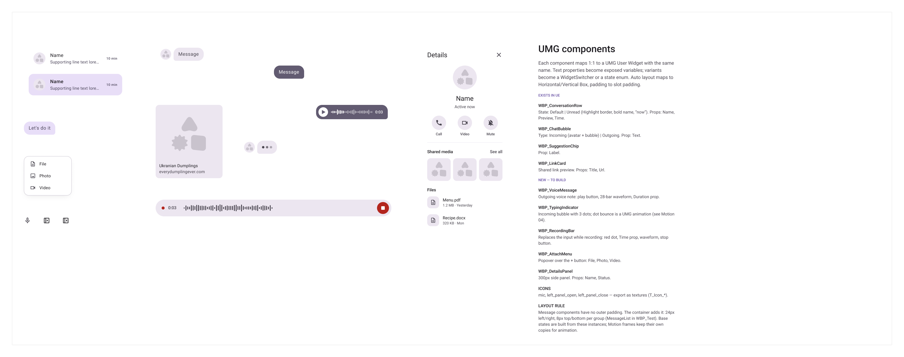

**Layouts.** Three base states of the screen. In Unreal they are one widget, `WBP_MessagingLayout`, with a `State` property.

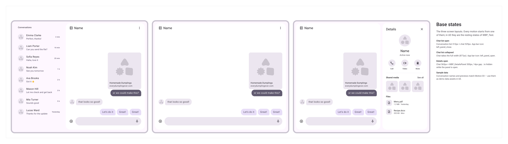

**Motion.** Every animation has its own section with a trigger, a timeline and build notes.

<table>
  <tr>
    <td>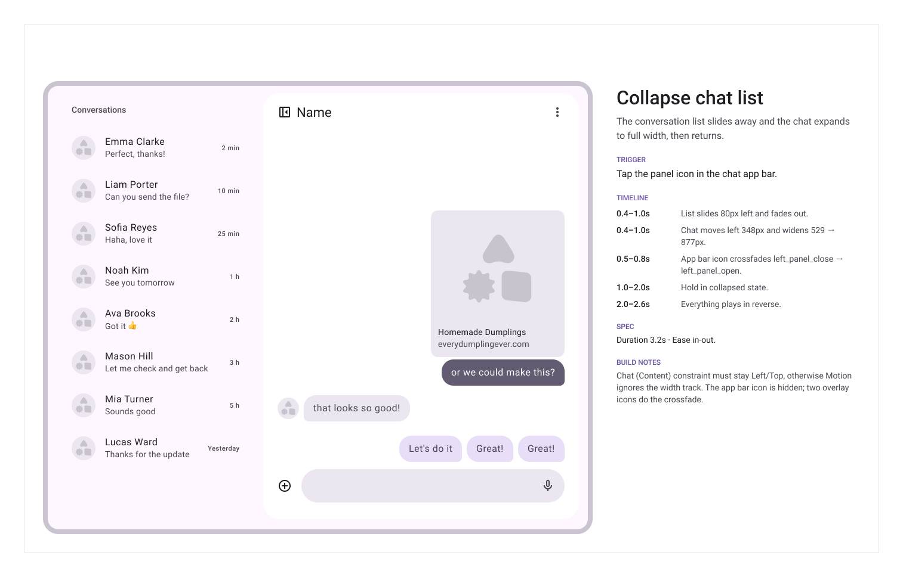</td>
    <td>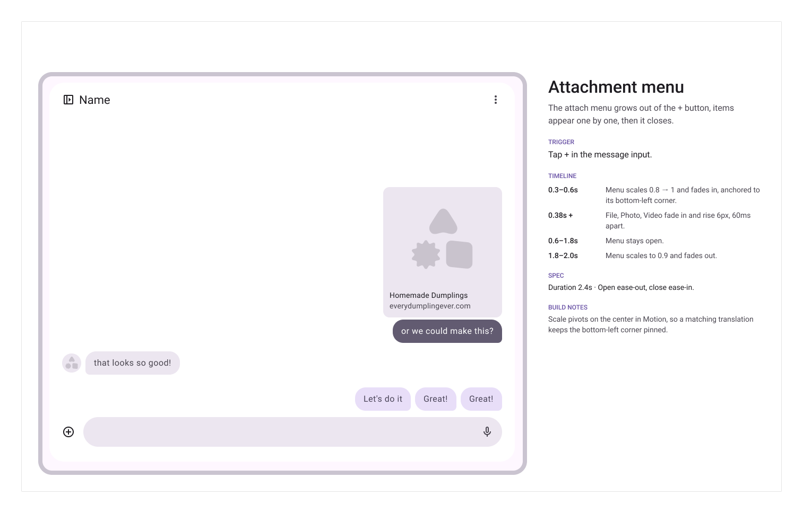</td>
  </tr>
  <tr>
    <td align="center">01 · Collapse chat list</td>
    <td align="center">02 · Attach menu</td>
  </tr>
  <tr>
    <td>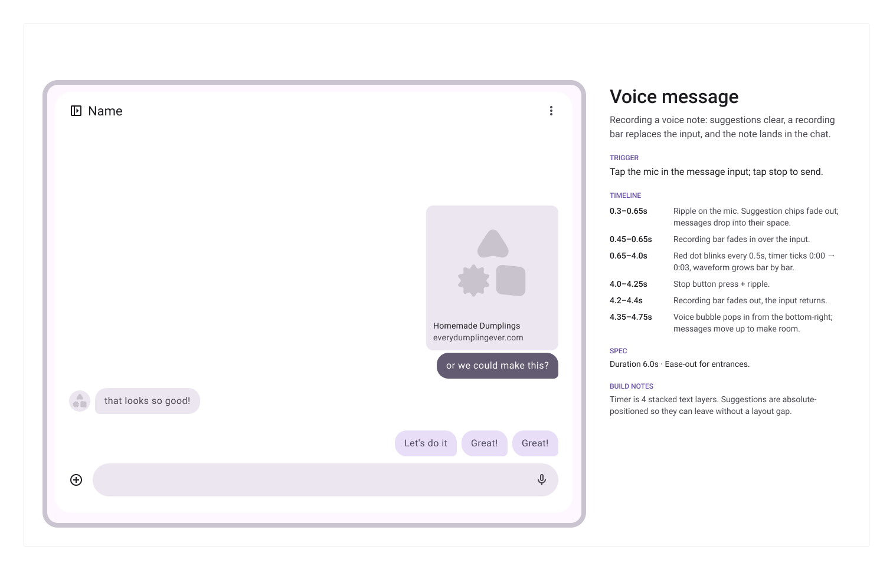</td>
    <td>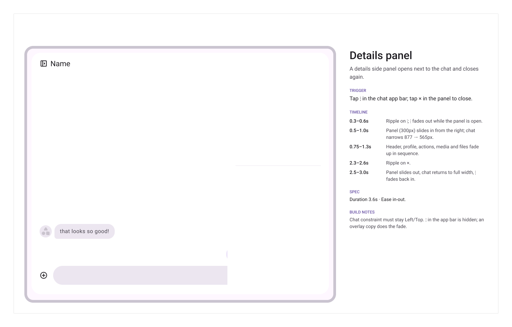</td>
  </tr>
  <tr>
    <td align="center">05 · Voice message</td>
    <td align="center">06 · Details panel</td>
  </tr>
</table>

## Figma vs Unreal

The same animation, "Collapse chat list", in Figma Motion (beta) and as `Anim_ListCollapse` in the UMG timeline.

<table>
  <tr>
    <th>Figma Motion</th>
    <th>Unreal UMG</th>
  </tr>
  <tr>
    <td>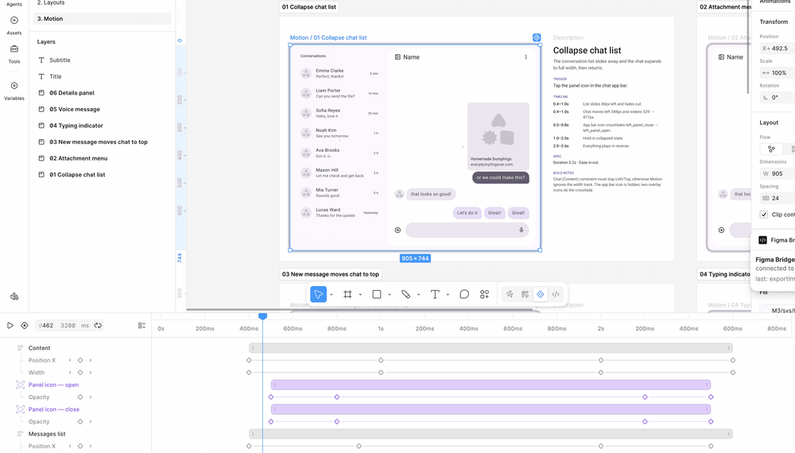</td>
    <td>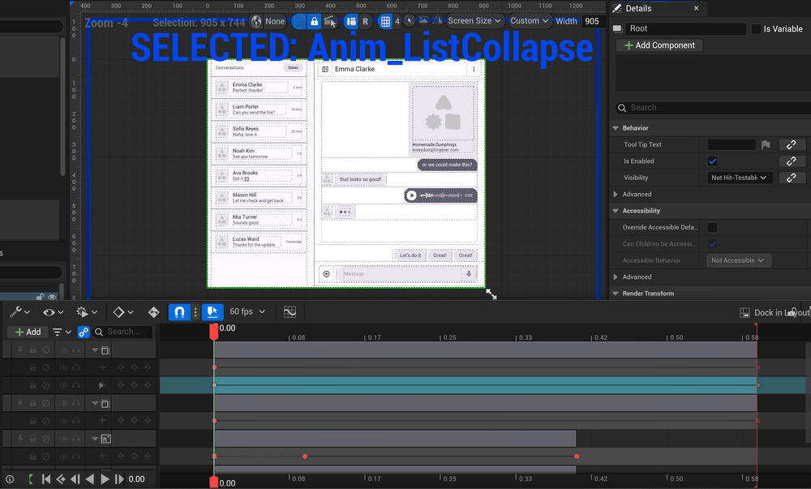</td>
  </tr>
</table>

### Component map

| Figma component | UMG widget | Notes |
|---|---|---|
| Conversation row | `WBP_ConversationRow` | States: Default, Unread. Props: Name, Preview, Time |
| Chat bubble | `WBP_ChatBubble` | Types: Incoming (avatar + bubble), Outgoing |
| Suggestion chip | `WBP_SuggestionChip` | Prop: Label |
| Link card | `WBP_LinkCard` | Shared link preview. Props: Title, Url |
| Voice message | `WBP_VoiceMessage` | Play button, 28-bar waveform, Duration |
| Typing indicator | `WBP_TypingIndicator` | Dot bounce is a UMG animation |
| Recording bar | `WBP_RecordingBar` | Replaces the input while recording |
| Attach menu | `WBP_AttachMenu` | Popover: File, Photo, Video |
| Details panel | `WBP_DetailsPanel` | 300 px side panel. Props: Name, Status |

## Inside the Unreal project

`WBP_MessagingLayout` in the UMG designer. The whole tree is built from the `WBP_*` components, at the Figma frame size (905×744).

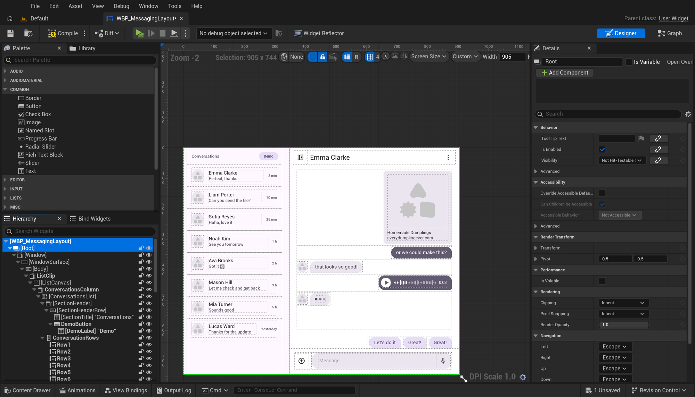

The Event Graph: each button, row and chip forwards its event to a layout function (`ToggleList`, `OpenDetails`, `SelectConversation`, ...).

<table>
  <tr>
    <td>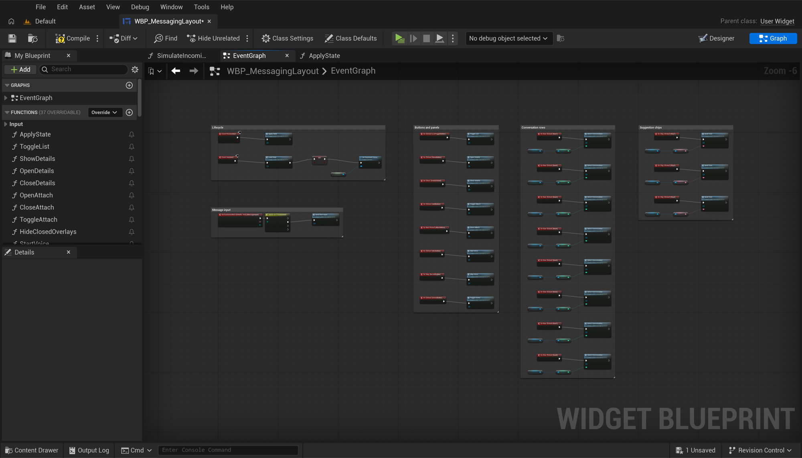</td>
    <td>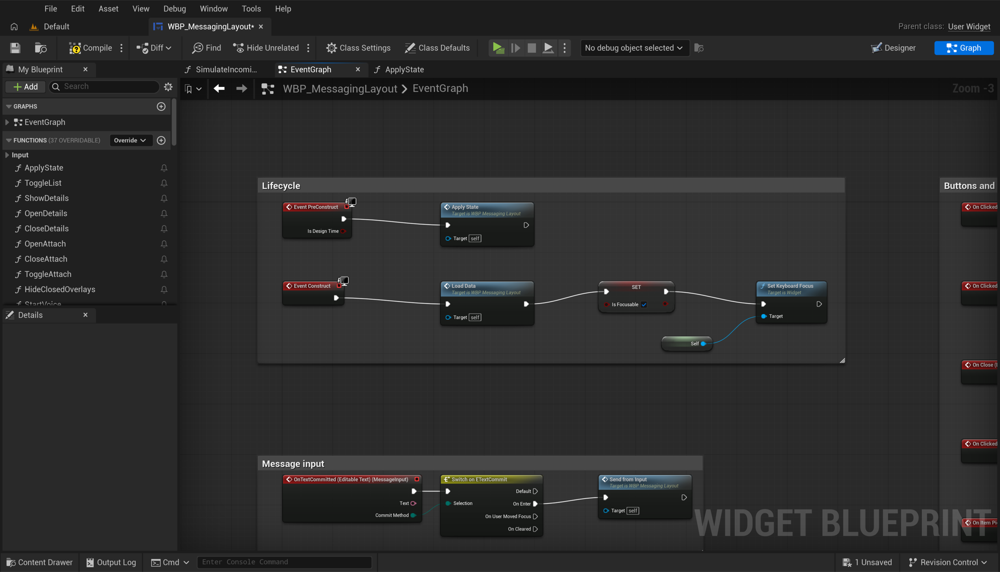</td>
  </tr>
  <tr>
    <td align="center">Event Graph</td>
    <td align="center">Close-up</td>
  </tr>
</table>

<details>
<summary><b>Content Browser and Reference Viewer</b></summary>

<br>

<table>
  <tr>
    <td>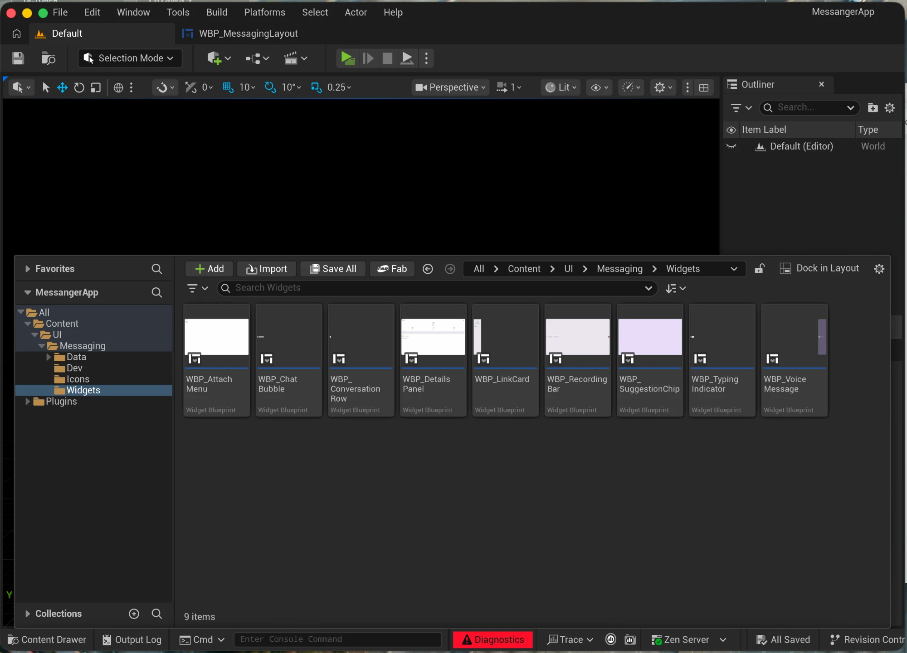</td>
    <td>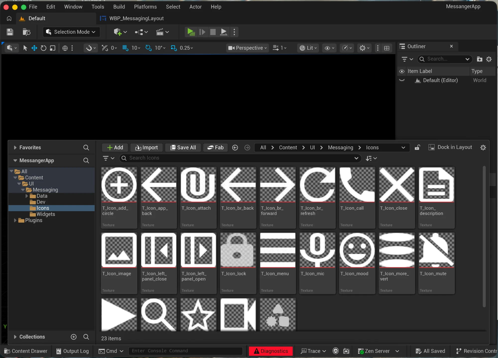</td>
  </tr>
  <tr>
    <td align="center">Component widgets, one per Figma component</td>
    <td align="center">Icons imported as textures (<code>T_Icon_*</code>)</td>
  </tr>
</table>

The Reference Viewer for `WBP_MessagingLayout`: the game mode and HUD that show it, and everything it uses.

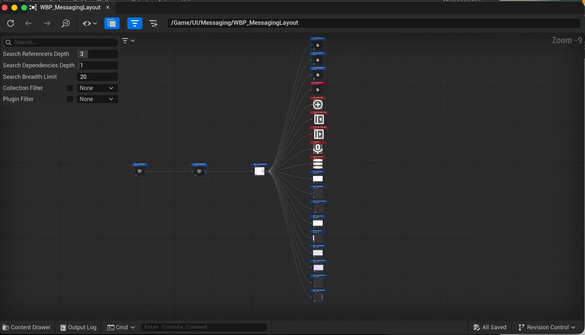

</details>

### What works

- Chat list, chat view and details panel, matching the Figma frames.
- Three layout states: list open, list collapsed, details open.
- Motion: collapse the list, open the attach menu, record and send a voice message, open the details panel, move a new message to the top of the list.
- Working chat: rows open their conversation, chips and Enter send messages, session messages survive switching conversations.
- A Demo button that plays incoming messages on a timer.

### Repo layout

```
Content/UI/Messaging/
├── WBP_MessagingLayout     main widget, 3 states
├── BP_UIGameMode, BP_MessagingHUD
├── Widgets/                9 components, one per Figma component
├── Icons/                  T_Icon_* textures (Material Symbols)
├── Data/                   BP_Conversation, BP_ChatMessage, BP_MessagingData
│   ├── Figma/              conversations from the Figma frames
│   └── Demo/               conversations for the Demo button
└── Dev/WBP_ComponentsPreview
Config/                     project, UI scale, Mac target
docs/                       images for this README
```

## Engineering details

What keeps this from being a one-off demo.

| Area | Detail |
|---|---|
| Naming | Figma component names = UMG widget names. Prefixes follow UE conventions: `WBP_`, `BP_`, `DA_`, `T_`, `Anim_` |
| Data | Conversations and messages are data assets, not hardcoded text. Two sets: Figma frames and Demo |
| Logic | Components only raise events. The layout owns state and logic in named functions |
| Size | Built at the Figma frame size, 905×744 |
| UI scale | Native Retina on Mac. Constant 2.0 scale: 1 UI unit = 1 pt on a 2x display, resizing adds room instead of zooming |
| Rendering | 3D features off: no Lumen, reflections, virtual shadows, ray tracing, bloom, motion blur, AA. The project only draws UI |
| Shaders | Mac build targets Metal SM6 only (Apple Silicon), skips the ~60 MB SM5 shader set |
| Code | No C++ game code. Widgets and Blueprints only |
| Licensing | MIT. Icons from Google Material Symbols, Apache 2.0 |

## Hardware

This project was built on a Mac mini (M6, 32 GB RAM).

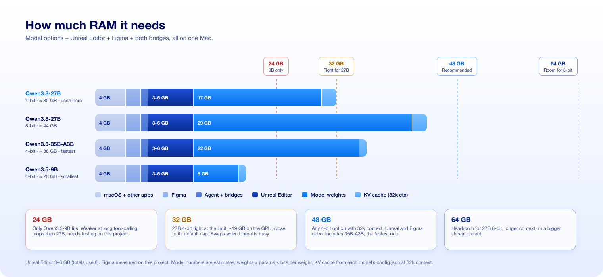

On a Mac, the model, Unreal Editor and Figma share the same unified memory.

| RAM | Verdict |
|---|---|
| 48 GB | Runs Qwen3.8-27B 4-bit with 32k context and both apps open |
| 32 GB | Tight, but works. This project was built on 32 GB |
| 24 GB | Only a smaller model, like Qwen3.5-9B |

Unreal Editor and Figma numbers are measured on this project. Model numbers are estimates.

## Run it

1. Open `MessangerApp.uproject` in Unreal Engine 5.8 on a Mac.
2. Press Play. The main widget is `Content/UI/Messaging/WBP_MessagingLayout`.

To get a standalone app: **Platforms → Mac → Package Project**.

If Unreal reports `UMGAnimToolset` missing, let it disable the plugin. The project does not need it to run.

## Limitations

- unreal-bridge is not published. The `.uproject` enables Epic's built-in `ModelContextProtocol` plugin and its toolsets instead, so you can try a similar setup.
- The agent's build scripts were throwaway and are not in the repo.
- Tested on Mac only.

## License

[MIT](LICENSE). Icons in `Content/UI/Messaging/Icons` are from [Google Material Symbols](https://github.com/google/material-design-icons), licensed under [Apache 2.0](https://www.apache.org/licenses/LICENSE-2.0).
