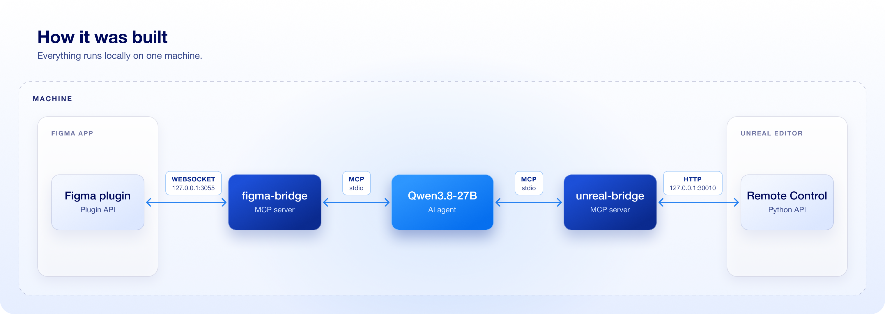

# Messanger App

A messenger UI built in Unreal Engine 5.8 with UMG only. No C++ game code, no 3D scene: every screen, component, animation and data asset was created by a local AI agent running [Qwen3.8-27B](https://huggingface.co/Qwen/Qwen3.8-27B) that read the design from Figma and wrote it into the Unreal Editor through MCP.

This is a test project. It shows what a local agent can do when it has a bridge to both tools.

Figma design: [Messanger App](https://www.figma.com/design/ixZDtpBk5UwKQ8aWuPHvpm/Messanger-App?node-id=15-8784)

## What's in the demo

- Chat list, chat view and details panel, matching the Figma frames.
- Three layout states: list open, list collapsed, details open.
- Components: conversation row, chat bubble, link card, suggestion chip, voice message, typing indicator, recording bar, attach menu, details panel.
- Motion from the Figma "Motion" page: collapsing the chat list, opening the attach menu, recording and sending a voice message, opening the details panel, a new message moving to the top of the list.
- Working chat: rows open their conversation, suggestion chips and Enter send messages, and session messages survive switching conversations.
- A Demo button in the list header that plays incoming messages on a timer.
- Conversations are data assets (`Content/UI/Messaging/Data`), not hardcoded text.

## How it was planned

The Figma file is the spec. Each page has notes next to the frames, and the agent followed them when it built the Unreal side.

**Components.** Each Figma component maps 1:1 to a UMG User Widget with the same name. The notes say which props to expose and which widgets already exist in UE.

**Layouts.** Three base states of the screen: chat list open, chat list collapsed, details open. In Unreal they are one widget (`WBP_MessagingLayout`) with a `State` property.

**Motion.** Every animation has its own section with a trigger, a timeline and build notes.

The same section played in the Figma Motion (beta) timeline:

## Result in Unreal

`WBP_MessagingLayout` in the UMG designer. The whole tree is built from the `WBP_*` components, at the Figma frame size (905×744).

The Event Graph of the same widget: each button, row and chip forwards its event to a layout function (`ToggleList`, `OpenDetails`, `SelectConversation`, ...).

`Anim_ListCollapse` (Figma Motion 01) scrubbed in the UMG animation timeline: the chat list collapses while the chat takes the full width.

The component widgets in `Content/UI/Messaging/Widgets`, one per Figma component:

Icons imported as textures (`T_Icon_*`):

The Reference Viewer for `WBP_MessagingLayout`: the game mode and HUD that show it, and everything it uses (data assets, icons, component widgets).

## How it was built

Everything runs locally on one machine. The agent sits in the middle and talks to both bridges over MCP (stdio).

**Model.** The agent ran locally on [Qwen3.8-27B](https://huggingface.co/Qwen/Qwen3.8-27B).

**Figma → agent.** [figma-bridge](https://github.com/MaxsBond/figma-bridge) is a local MCP server plus a Figma dev plugin. The bridge talks to the plugin over WebSocket on `127.0.0.1:3055`, and the plugin uses the Figma Plugin API to read the open file: node trees, layout, colors, text, exported icons. It also works on a View seat and has no rate limits.

**Agent → Unreal.** unreal-bridge is a custom-built MCP server for the Unreal Editor, used here instead of the official Unreal MCP. It is not published. It runs as a separate local process, like figma-bridge, and sends HTTP requests to the editor's Remote Control API on `127.0.0.1:30010`. Commands run through the editor's Python API, which has access to UMG widgets, animations, data assets and string tables. The agent uses it to add widgets, set properties, create Blueprint functions and events, and edit config.

Animations were authored with a custom editor toolset, `UMGAnimToolset`, that creates Sequencer tracks and keys in Widget Blueprints. It is not part of this repo.

**How the agent worked.** Instead of clicking through the editor, the agent wrote throwaway Python scripts that described the UI and sent it to unreal-bridge: component widgets, the layout with its three states, animations, chat logic and the demo data assets. The scripts were removed once the assets were done; the result lives in `Content/`.

## Run it

1. Open `MessangerApp.uproject` in Unreal Engine 5.8 (Mac).
2. Play in editor. The main widget is `Content/UI/Messaging/WBP_MessagingLayout`.

The `.uproject` still lists the editor-only `UMGAnimToolset` plugin. If Unreal reports it missing, let it disable the plugin: the project does not need it to run.
